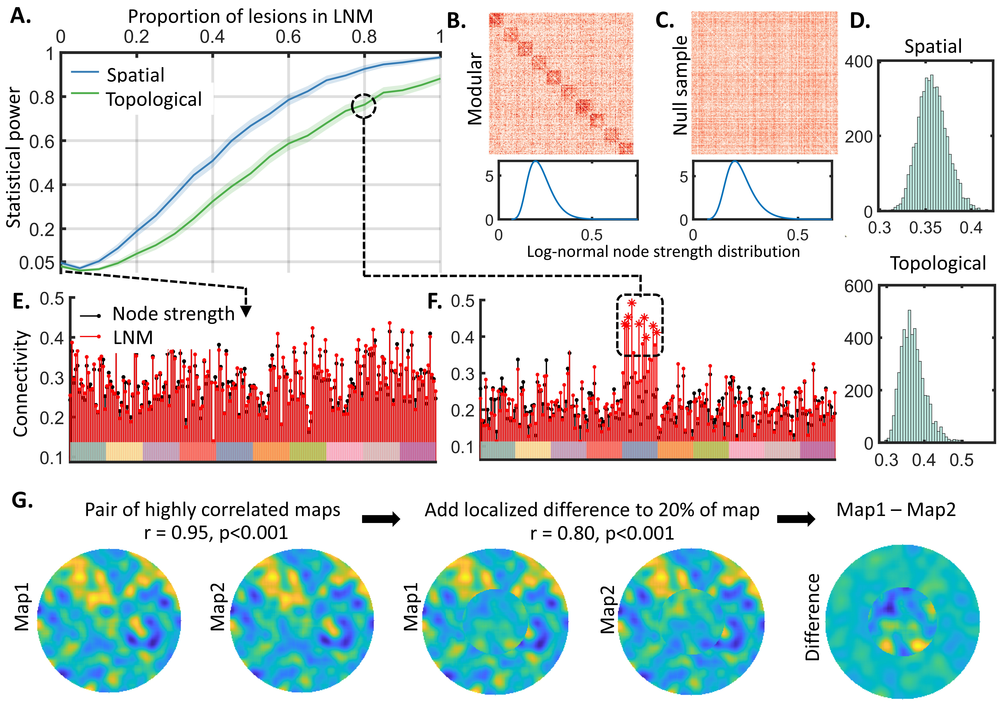

# Permutation-based null models for lesion network mapping (LNM)

[Lesion network mapping (LNM)](https://pubmed.ncbi.nlm.nih.gov/26264514/) is a popular methodology to to identify brain circuits disrupted by spatially distributed lesions associated with the same symptom or clinical phenotype.

We evaluate the statistical power of spatial and topological null models for the compact LNM model proposed by [van den Heuvel and colleagues (2026)](https://www.nature.com/articles/s41593-025-02196-7). The authors used the compact model to support their argument that most lesion network maps reflect generic hub structure in the connectome rather than disease-specific circuits, raising important questions about the method's specificity and generating debate in the LNM field, as summarized [here](https://www.thetransmitter.org/brain-imaging/methodological-flaw-may-upend-network-mapping-tool/) and [here](https://www.science.org/content/article/flaw-brain-mapping-technique-may-undercut-neuroscience-findings).

The simulations presented here are intended as a constructive response to the concerns raised by the authors, using permutation-based null models. We note that these simulations rely on the compact LNM framework proposed by the authors and on synthetic lesion data. Accordingly, the extent to which these findings generalize to LNM analyses of clinical lesion datasets remains to be established.

## Compact LNM model
The compact LNM is based on a single functional connectivity matrix defined at a regional scale. There is no modeling of individuals. Each lesion maps to one and only one region. Depending on the lesion assignment type, multiple lesions can be mapped to the same region. This simplified LNM formulation is best viewed as an illustrative model and may differ from the properties of voxel‐resolution LNM applied across individuals.

## Simulated functional connectivity matrix
The matrix is generated using a degree-controlled stochastic block model (dcSBM). Connectivity weights are sampled from a beta distribution. The matrix is symmetric, undirected, fully connected and comprises *B* modules. Each module contains *M* nodes (regions) and the total number of nodes is thus *N=BM*. The node strength distribution is approximately log-normal.  

## Lesions sets and ground-truth lesion network map
The ground-truth lesion network map is always defined by a single module comprising the simulated functional connectivity matrix. Rather than conforming to a single predefined module at one scale, lesion network maps in practice may comprise more complex or multiscale topological organization. By restricting the ground‐truth lesion network map to a single module, the analysis focuses on only one possible topological pattern that LNM might detect.

We consider a total of *K* lesions. A proportion *alpha* of these *K* lesions is necessarily assigned to nodes comprising the ground-truth module. The remaining lesions are uniformly distributed at random across all nodes, irrespective of modular allegiance. The parameter *alpha* determines the propotion of lesions in the lesion network map and we plot statistical power as a function of *alpha*. 

- **Null condition.** When *alpha=0*, all lesions are distributed uniformly and this case evaluates the specifcity of the methodology under the null hypothesis (i.e. family-wise error rate, FWER).
- **True effect.** As *alpha* increases above zero, more lesions are concentrated in the ground truth LNM and statistical power thus increases.

## Null models 
We evaluate spatial and topological null models. The spatial null model is based on the null hypothesis that the observed lesion network map is consistent with an equal number of equally sized lesions distributed uniformly at random throughout the brain, or distributed to loci with similar node strength/degree. The topological null hypothesis is that the observed lesion network map is consistent with a functional network in which higher-order topological properties hypothesized to support disease-specific circuits are absent. To generate samples from the topological null model, we draw networks from the same dcSBM used to generate the functional connectivity matrix, while explicitly excluding modular structure from the generative process. The null networks are matched in strength distribution to the simulated functional connectivity matrix. Note that [we](https://www.nature.com/articles/s44220-023-00038-8) and [others](https://www.nature.com/articles/s44220-024-00348-5) have previously considered variants of the spatial null model.

## Statistical testing 
The null distribution for both null models is constructed by identifying the node with the maximum value in the lesion network map and storing this value. This is a conservative null distribution that ensures strong control of the FWER under assumptions of exchangeability. Nodes in the observed lesion network map are deemed statistically significant if they exceed the 95th percentile of the null distribution, ensuring control of the FWER at 0.05. See [Nichols and Holmes (2002)](https://pubmed.ncbi.nlm.nih.gov/11747097/). The number of permutations and samples in the null distribution is determined by *Perms*.  

## Evaluation metrics
We generate many lesions sets and corresponding lesion network maps for a given set of parameters (i.e. *N*, *alpha*, *K*, etc) and undertake the null hypothesis testing described above for each iteration. Each such repeated iteration is referred to as a trial. The following measures are computed as the proportion of certain events across trials.  

- **Statistical power** is the proportion of trials for which one or more nodes are deemed significant within the ground-truth lesion network map when *alpha>0*.
- **Family-wise error rate (FWER)** is the proportion of trials for which one or more nodes are deemed significant anywhere in network when *alpha=0* (null condition).
- **Strong FWER** is the proportion of trials for which one or more nodes are deemed signifciant outside the ground-truth lestion network map when *alpha>0*.

## Matlab code

The Matlab code provided here enables implementation of the simulations to generate components of the below figure.
- **main.m** is a script to evaluate all metrics as a function of *alpha*, *K* or a single parameter combination. The choice of null model, network parameters as well as the number of permutations and trials is specifcied in this script. 
- **dcsbm.m** generates weighted, symmetric undirected networks with and without modular structure.
- **lesion_assignment.m** maps lesions to nodes based on modular allegiance. 
- **lnm_compute.m** computes the lesion network map and contains the for-loop to generate samples to build the null distribution.
- **precompute_topology_randomization.m** generates a set of functional connectivity matrices under the null hypothesis. The same set of precomputed matrices are used for all trials to save computation time.
- **show_progress.m** is a helper function.

Note that the [cbrewer package](https://github.com/scottclowe/cbrewer2) is needed to generate some figures. 

## Assignment of lesions to regions 
The variable *Assignment_Type* determines how lesions are assigned to regions for the observed lesion set and under the null conditions. Three options are available: 
- 1: A region is assigned at most one lesion in both the observed lesion set and under the null.
- 2: A region can be assigned multiple lesions in both the observed lesion set and under the null. 
- 3: Same as 2, but under the null condition, lesions are randomized to approximately match node strength in the observed lesion set. Note that this option is only relevant for the spatial null model. For each lesion, a set of *U* candidate nodes that are closest in strength to the actual lesion node are defined and the lesion node is repositioned to a randomly selected candidate node. When *U* is small, strength matching is accurate but the diversity of randomizations is constrained.

# Clinical lesion maps
We also apply our permutation-based spatial null model to the lesions sets made available by van den Heuvel et al. See the folder *./clinical_lesions/*

# Localized differences in the presence of global spatial correlation 

An example is provided to demonstrate that localized differences can be present between two maps despite high spatial correlation between them (r>0.8). We first generate two highly correlated maps on a circular domain with spatial autocorrelation. We then add a difference between the two maps at a region comprising 20% of the circular domain's area. We show that despite a striking difference, the two maps remain highly correlated. 

- **test_corr.m** is a script that generates the maps, performs spatial correlation between them and generates a figure.
- **permutatation_null.m** generates a null distribution for the spatial correlation coeffcient by regenerating samples of the image with the same level of spatial autocorrelation but without any systematic correlation between the two maps. 

Email: azalesky@unimelb.edu.au

  

